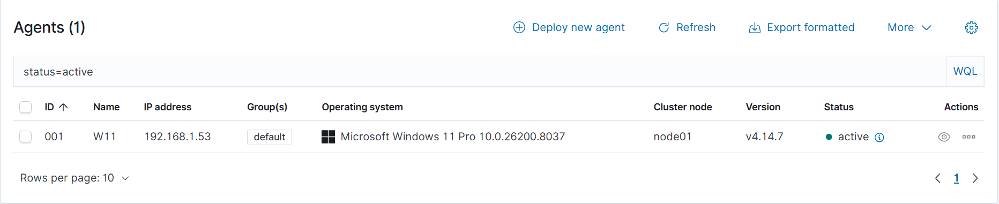
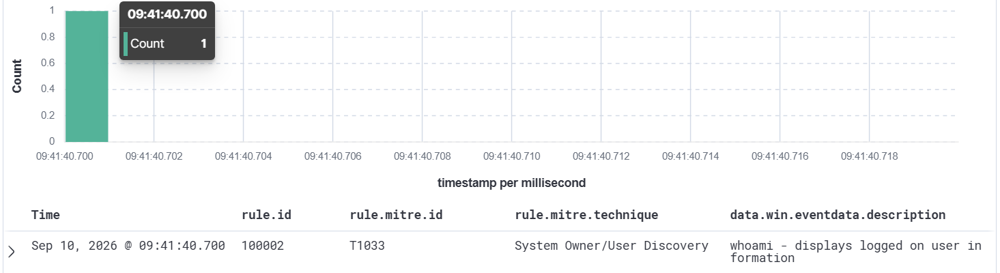
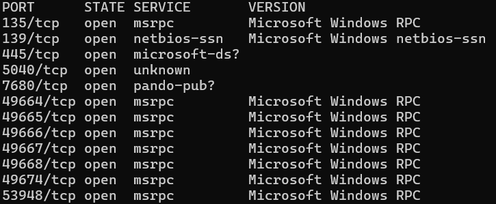
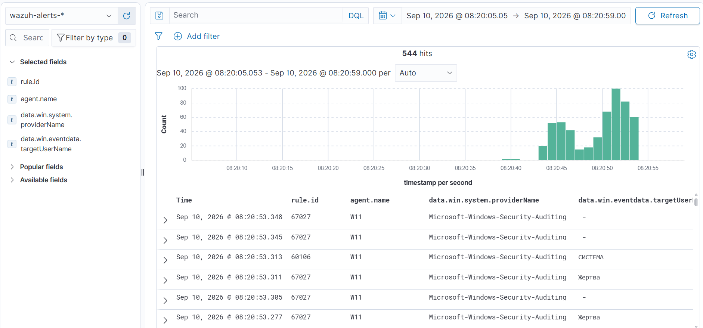

# Домашний ИБ-проект: Развертывание Home SIEM + Writeup

---

## Часть 1. Архитектура и развертывание лабораторного стенда

### 1.1. Аппаратная и программная база хоста
В качестве физического фундамента для ИБ-лаборатории используется персональный компьютер со следующими характеристиками:
* **Процессор**: AMD Ryzen. Мощности ЦП достаточно для одновременного запуска контейнеров мониторинга и виртуальной машины.
* **Основная ОС**: Windows 11. Выступает хостом для среды виртуализации и подсистемы Linux.

### 1.2. Компоненты инфраструктуры
Лаборатория состоит из трех изолированных зон, имитирующих реальную корпоративную среду:

1. **Сервер мониторинга (SIEM)**
   * **Платформа**: Wazuh SIEM версии 4.14.7.
   * **Тип развертывания**: Набор Docker-контейнеров (Indexer, Manager, Dashboard).
   * **Среда запуска**: Подсистема Kali Linux WSL2, запущенная прямо на Windows-хосте.
   * **Сетевой статус**: Сервер слушает порты `1514` (прием телеметрии) и `1515` (регистрация агентов). Веб-панель управления доступна через браузер хоста.




2. **Машина жертвы (Endpoint)**
   * **Платформа**: Виртуальная машина Windows 11 Pro.
   * **Среда запуска**: Среда виртуализации Oracle VirtualBox.
   * **Сетевой режим**: «Сетевой мост» (Bridged Adapter). Виртуальная машина подключена к локальной сети напрямую и имеет выделенный IP-адрес: `192.168.1.53`.

3. **Машина атакующего (Attacker)**
   * **Платформа**: Терминал Kali Linux внутри WSL2.
   * **Сетевой статус**: Имеет внутренний IP-адрес `172.27.33.137`. Благодаря маршрутизации WSL2, обладает прямой сетевой видимостью жертвы.

### 1.3. Инструменты глубокого аудита на стороне жертвы
Для максимальной видимости процессов внутри Windows 11 развернут сертифицированный комплекс защиты:
* **Wazuh Agent**: Локальный агент безопасности, который поддерживает постоянную связь с SIEM-менеджером (статус `Active`). Он отвечает за отправку системных журналов.
* **Microsoft Sysmon**: Системная утилита от Microsoft для расширенного мониторинга ОС.
* **Конфигурация**: Использован популярный защищенный шаблон **SwiftOnSecurity**. Он позволяет глубоко отслеживать создание процессов (Event ID 1), сетевые соединения процессов (Event ID 3) и загрузку подозрительных DLL. Логи Sysmon автоматически перехватываются агентом Wazuh и передаются в SIEM.

---

## Часть 2. Настройка сквозной телеметрии и кастомных правил детекции

### 2.1. Ограничения базовой конфигурации SIEM (Проблема)
При первоначальном тестировании сквозного прохождения логов на Windows-жертве была выполнена легитимная команда разведки `whoami`. 
* **Поведение системы**: Утилита Sysmon успешно зафиксировала создание процесса (Event ID 1). Агент Wazuh передал это событие на сервер мониторинга.
* **Результат**: На сервере сработало стандартное правило Wazuh. Однако в базовой комплектации данное событие имеет низкий уровень приоритета (**Rule Level 0** — системный шум). По правилам фильтрации Wazuh, события с уровнем ниже 3 автоматически игнорируются индексатором и не отображаются в панели управления `Explore -> Discover`.

### 2.2. Разработка кастомного правила детекции (Решение)
Для принудительной фиксации факта системной разведки была изменена логика работы аналитического движка SIEM. Через встроенный редактор правил в конфигурационный файл менеджера **`local_rules.xml`** было добавлено кастомное правило сигнатурного анализа:

```xml
<group name="windows, sysmon, discovery">
  <rule id="100002" level="10">
    <if_sid>67027</if_sid>
    <field name="win.eventdata.image">whoami.exe</field>
    <description>Cybersecurity Project: Host Discovery via whoami.exe detected</description>
    <mitre>
      <id>T1033</id>
    </mitre>
  </rule>
</group>
```

**Разбор параметров кастомного правила:**
* `id="100002"` — уникальный идентификатор пользовательского правила (диапазон для кастомных правил начинается с 100000).
* `level="10"` — принудительно высокий уровень опасности (Alert Level). События с таким уровнем гарантированно сохраняются в базу данных и подсвечиваются в консоли SOC как критические аномалии.
* `<if_sid>67027</if_sid>` — дочерняя зависимость. Правило срабатывает только в том случае, если исходный лог уже был классифицирован как событие создания процесса Sysmon (Rule ID 67027).
* `<field name="win.eventdata.image">whoami.exe</field>` — точечный фильтр. Правило ищет в теле лога конкретное имя исполняемого файла.
* `<mitre><id>T1033</id></mitre>` — автоматический маппинг. Связывает сработавший алерт с международной базой знаний тактик и техник атак **MITRE ATT&CK: System Owner/User Discovery**.

### 2.3. Верификация сквозной аналитики (Результат)
Для проверки детекции на машине Windows 11 повторно запустили команду `whoami`. 
1. Инструмент **Sysmon** перехватил создание процесса в ядре ОС.
2. **Wazuh Agent** мгновенно вычитал событие из системного журнала и отправил на сервер.
3. **Wazuh Manager** прогнал лог через `local_rules.xml`, распознал сигнатуру `whoami.exe`, присвоил событию статус инцидента (Level 10) и обогатил его контекстом MITRE T1033.
4. Инцидент успешно отобразился в веб-панели **Wazuh Dashboard (Explore -> Discover)** в виде яркого алерта, готового к обработке аналитиком безопасности.




---

## Часть 3. Верификация сетевой связности компонентов лаборатории

### 3.1. Архитектурная задача сетевой интеграции
Для проведения успешных симуляций атак требовалось обеспечить прямую двустороннюю видимость на сетевом уровне между изолированной средой контейнеризации Docker (внутри подсистемы WSL2) и изолированной средой виртуализации Oracle VirtualBox.

### 3.2. Настройка и проверка маршрутизации
Проверка сетевой доступности проводилась между хостом атакующего (Kali Linux WSL2) и целевой системой (Windows 11 Pro).
* **Конфигурация жертвы**: За счет перевода сетевого адаптера виртуальной машины VirtualBox в режим **«Сетевой мост» (Bridged Adapter)**, операционная страница Windows 11 получила прямой IP-адрес (`192.168.1.53`) в физической подсети домашнего роутера. Она стала видна как отдельное полноценное устройство в сети.
* **Конфигурация атакующего**: Подсистема Kali Linux WSL2 (IP-адрес `172.27.33.137`) использует встроенные механизмы трансляции и маршрутизации сетевого стека хоста.

### 3.3. Результаты тестирования (Тест ICMP)
Для верификации связности в терминале Kali Linux была выполнена команда проверки доступности узла с ограничением по количеству пакетов:
```bash
ping -c 4 192.168.1.53
```

**Разбор ключей команды:**
* `ping` — утилита для проверки целостности и доступности сетей на основе протокола ICMP.
* `-c 4` (count) — указывает отправить ровно 4 эхо-запроса к целевому узлу и завершить работу.
* `192.168.1.53` — целевой IP-адрес машины-жертвы.

**Итог проверки:** Трафик прошел напрямую, отправлено 4 пакета, получено 4 ответа, потери пакетов составили 0%. Стенд полностью готов к симуляции атак.

---

## Часть 4. Симуляция первой сетевой аномалии и анализ телеметрии

### 4.1. Сетевая разведка (Reconnaissance / Discovery)
С хоста атакующего (Kali Linux) было выполнено агрессивное сканирование портов жертвы (Windows 11) с помощью утилиты `nmap` для обнаружения активных служб и векторов для потенциального закрепления.

Команда запуска в терминале Kali Linux:
```bash
sudo nmap -sS -sV -O -p- --open 192.168.1.53
```

**Разбор ключей команды:**
* `sudo` — запускает утилиту с правами суперпользователя (root). Требуется для формирования сырых (RAW) сетевых пакетов, необходимых для SYN-сканирования и определения ОС.
* `-sS` (TCP SYN scan) — метод «полуоткрытого» сканирования. Утилита отправляет пакет со флагом `SYN` и сбрасывает соединение пакетом `RST` сразу после получения ответа `SYN/ACK`. Это позволяет обнаружить порт, не создавая полноценной TCP-сессии.
* `-sV` (Version intensity) — включает исследование открытых портов для определения типов и версий запущенных служб с помощью серии специальных запросов (probes).
* `-O` (Enable OS detection) — активирует функцию определения операционной системы на основе анализа различий в реализации сетевого стека TCP/IP целевой машины.
* `-p-` (Scan all ports) — указывает сканировать весь диапазон портов от 1 до 65535 (вместо стандартной тысячи популярных портов).
* `--open` — дает команду выводить в терминал только те порты, которые реально открыты, отсекая заблокированные брандмауэром порты.
* `192.168.1.53` — IP-адрес целевой машины Windows 11.

**Результаты сканирования nmap зафиксировали следующие открытые порты:**
* `135/tcp` (Microsoft Windows RPC) — служба удаленного вызова процедур.
* `139/tcp` (NetBIOS-ssn) — устаревший протокол сеансового уровня NetBIOS.
* `445/tcp` (Microsoft-ds) — критически важная служба SMB, используемая для общего доступа к файлам и принтерам.
* Высокие динамические порты RPC (`49664-53948/tcp`) — порты, выделяемые службой RPC для передачи данных клиентам.




### 4.2. Анализ аномалий в Wazuh SIEM
В момент проведения сканирования в панели Wazuh Dashboard (Explore -> Discover) был зафиксирован аномально высокий всплеск однотипных событий (сотни логов за короткий промежуток времени):



1. **Rule ID: 60106 (Windows Logon Success)**
   * **Механика**: Вызвано массовой отправкой nmap-пакетов (с ключом `-sV`) на порты SMB (445) и RPC (135). Windows обрабатывает эти запросы как попытку сетевой аутентификации. Система генерировала системные события Event ID 4624 (тип входа: Network / Anonymous Logon) на каждый зондирующий запрос утилиты.
   
2. **Rule ID: 67027 (A process was created — Sysmon Event ID 1)**
   * **Механика**: В процессе исследования сетевого стека утилитой nmap и попыток определить тип ОС (`-O`), операционная система жертвы инициализировала системные триггеры, что привело к кратковременному созданию и перезапуску дочерних процессов служб Windows (например, `svchost.exe`).

### 4.3. Анализ сопутствующих аномалий (False Positive Триаж)
В ходе мониторинга активности во время сетевого сканирования системой Wazuh был также зафиксирован сторонний высокоуровневый алерт детекции угрозы:
* **Тип угрозы**: Подозрение на DLL Search Order Hijacking (**MITRE ATT&CK T1574.001**)
* **Rule ID**: 92219
* **Целевой объект**: Создание файла `C:\Windows\SystemTemp\{EC07F8D8-3FCA-468D-BD5F-A1C68802907E}\ssshim.dll` в корневом каталоге Windows.

**Аналитическое заключение по инциденту:**
В результате верификации события (Triage) инцидент признан Ложноположительным (False Positive). Источником активности является легитимный системный установщик Microsoft .NET Framework, использующий директорию `SystemTemp` для распаковки временных компонентов. В реальной боевой инфраструктуре для данного правила рекомендуется настроить кастомное исключение (Exclusion Filter) в `local_rules.xml` для доверенных путей и цифровых подписей Microsoft, чтобы снизить уровень «шума» в консоли мониторинга SOC.

---

## Часть 5. Заключение и итоги проекта

В ходе выполнения данного пет-проекта были успешно решены все поставленные задачи по развертыванию, настройке и тестированию домашней SIEM-системы:

1. **Развернута инфраструктура**: С нуля поднята отказоустойчивая связка из Wazuh SIEM (в Docker/WSL2) и агента мониторинга на Windows 11 Pro (VirtualBox).
2. **Настроена глубокая телеметрия**: Интеграция Microsoft Sysmon с конфигурацией SwiftOnSecurity позволила собирать расширенные логи операционной системы (включая создание процессов и аудит сетевых соединений).
3. **Освоена кастомная детекция**: На примере команды `whoami` и создания правила `100002` в `local_rules.xml` изучен механизм сигнатурного анализа и маппинга событий на матрицу **MITRE ATT&CK (T1033)**.
4. **Проведена симуляция атаки**: С помощью утилиты `nmap` осуществлена сетевая разведка, проанализирован аномальный всплеск событий безопасности в Wazuh Dashboard (правила `60106` и `67027`), а также отработаны навыки триажа ложноположительных срабатываний (False Positives).

**Итог**: Разработанный стенд полностью выполняет функции центра мониторинга безопасности (SOC) в миниатюре. Проект зафиксировал базовые принципы Endpoint детекции и реагирования на угрозы, создав прочный фундамент для дальнейшего изучения практической кибербезопасности.

