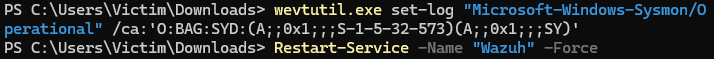
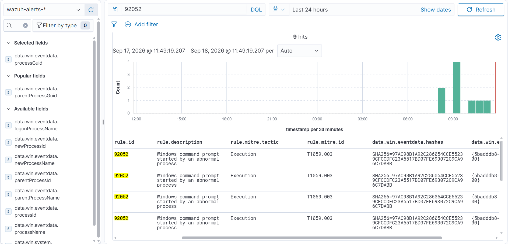

# Домашняя SOC-Лаборатория: Wazuh + Sysmon (Развертывание, Troubleshooting и Боевая Детекция)

Этот проект — моя практическая лабораторная работа по созданию домашней SIEM/SOC-системы. Я строил её по методике из видео Mad Hat, но вместо банального копирования туториала я столкнулся с реальными проблемами Windows 11 и решил их.

Главная цель лабы: подружить агент Wazuh с глубокими логами Sysmon и поймать реальную хакерскую атаку.

---

## 🛠 Часть 1: С чем я столкнулся (Troubleshooting)

Самый большой урок этого проекта: **никогда не верь логам на слово**. Изначально мне казалось, что всё работает, но детальный разбор показал, что логи Sysmon вообще не доходили до сервера. Я исправил три критические ошибки:

1. **Конфликт языков (Ловушка кириллицы):** 
   Мой тестовый пользователь в Windows назывался на русском — `Жертва`. Из-за этого Sysmon генерировал логи с русскими буквами. Когда агент Wazuh пытался упаковать этот лог и отправить на сервер, он спотыкался о кодировку (`invalid UTF-8 byte`) и просто молча выбрасывал лог. 
   * *Решение:* Полное удаление старого профиля и создание чистого англоязычного пользователя `Victim`. В инфраструктуре всё должно быть на английском.

2. **Закрытый замок Windows 11 (Права доступа):**
   Оказалось, что в Windows 11 журнал Sysmon изолирован. Служба Wazuh работала в системе, но у нее не было прав банально «читать» этот журнал. Wazuh заглядывал туда, видел пустоту и молчал.
   * *Решение:* Я использовал системную команду `wevtutil`, чтобы принудительно выдать права на чтение журнала Sysmon для учетной записи, под которой работает Wazuh.



3. **Формат данных:**
   Я перевел чтение журнала в современный формат `eventchannel`. Это позволило серверу Wazuh превращать сырые логи Windows в аккуратные JSON-структуры, с которыми можно удобно работать.

---

## 🎯 Часть 2: Боевой сценарий — Поведенческий анализ против Маскировки

Я решил отказаться от написания хрупких кастомных правил под конкретные имена файлов (вроде `whoami.exe` или `evil_script.exe`). Хакеру достаточно переименовать файл, и такое правило станет бесполезным. Вместо этого я решил проверить, как встроенная база правил Wazuh (более 4000 правил «из коробки») справляется с поведенческими аномалиями.

### 🪓 Атака (Маскировка / MITRE ATT&CK T1036.005)
Я сымитировал действия продвинутого атакующего: создал скрытую папку в публичных документах, скопировал туда системную командную строку `cmd.exe`, но полностью замаскировал её под легитимное обновление операционной системы — `windows_update.exe`.
```powershell
# Создание директории и маскировка файла в PowerShell от Администратора
New-Item -Path "C:\Users\Public\Documents\MalwareTest" -ItemType Directory -Force
Copy-Item -Path "C:\Windows\System32\cmd.exe" -Destination "C:\Users\Public\Documents\MalwareTest\windows_update.exe"

# Запуск замаскированной вредоносной нагрузки
& "C:\Users\Public\Documents\MalwareTest\windows_update.exe" /c "echo Симуляция атаки!"
```

### 🛡 Защита (Встроенная экспертиза Wazuh Ruleset)
Несмотря на то, что имя файла было полностью изменено, встроенный движок правил Wazuh, обогащенный глубокой телеметрией Sysmon, мгновенно распознал аномальное поведение процесса (запуск командной строки из нетипичного родительского процесса) и сгенерировал алерт:

*   **Идентификатор правила (Rule ID):** `92052`
*   **Описание:** `Windows command prompt started by an abnormal process`
*   **Тактика MITRE ATT&CK:** `Execution`
*   **Техника MITRE ATT&CK:** `T1059.003 (Windows Command Shell)`

Благодаря интеграции с Sysmon, к событию автоматически привязались уникальный идентификатор процесса `processGuid` и криптографический хэш файла (`hashes: SHA256=...`), что позволяет аналитику SOC мгновенно запустить процесс Threat Hunting и проверить хэш по базе VirusTotal.



---

## 🧠 Главные выводы проекта
1. **Эффективность "из коробки":** Коммерческие SIEM-системы обладают огромной встроенной экспертизой. Задача для начала — не писать правила с нуля, а правильно настроить сенсоры (Sysmon) и обеспечить чистоту потока данных, чтобы встроенный Ruleset работал на максимум.
2. **Телеметрия Sysmon против Security-журнала:** Стандартный аудит Windows фиксирует только поверхностный старт процесса. Sysmon дает контекст (хэши, GUID, сетевую активность процесса), без которого невозможно детектировать скрытые угрозы и техники маскировки (Masquerading).
3. **Ценность ошибок:** Траблшутинг в процессе настройки дал мне гораздо больше практических знаний об устройстве ОС Windows и SIEM, чем если бы лабораторная работа запустилась по шаблону с первого клика.
